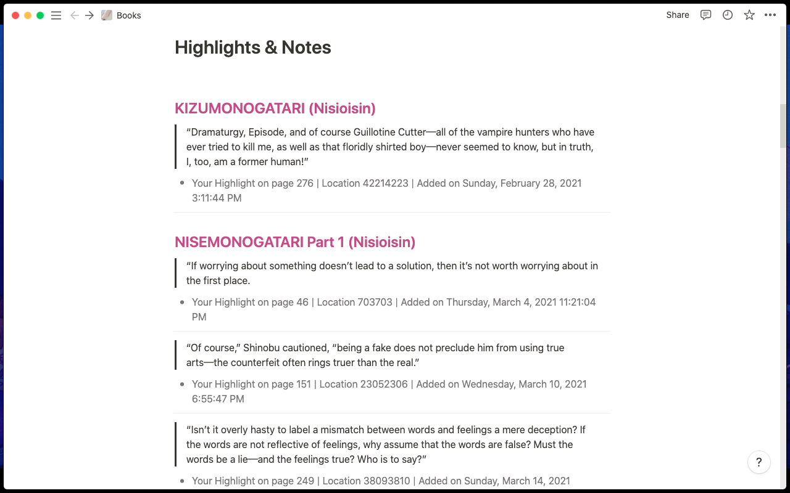

# Overview
BookNote is simple yet configurable CLI tool written in python that allows you to upload your kindle highlights to a Notion page.

# Customization
You are able to customize both which the type and the color of each component block, those being:

- The `Title` of the book: Which is the parent block for all highlights from the book (can be a page, toggle, Header, ...).

- The `Quote`: Representing the highlight being saved.

- The `Annotation`: That is the location of the highlight in the book and when it was made.

We explore in more details what are the options for them in the [style.json](###style.json) section of the READEME, but you can see one of the possible customizations down bellow:



# Installation and Configuration

## Installation 
The easiest way to install is to use pip and git as follows:
```bash
pip3 install git+https://github.com/Pedro4064/Kindle_Notion.git@master
``` 
And that will install everything need to run BookNote.

## Configuration
By default the python package will create a folder in you `.config` directory named `booknote` and inside will store all the necessary files, those being:

### config.json

This files contains all the "environment" variables needed to config the tool, those being:
|Variable| Description| Default Values|
|--------|------------|---------------|
|`notion.v2token`| v2 toke to access the notion API| `EMPTY`|
|`notion.page`| The url for the target Notion page| `EMPTY`| 
|`kindle.location`| The location where the kindle device is mounted| `'/Volumes/Kindle' if platform=='darwin' else '/media/Kindle'`|
|`kindle.log`| The file where BookNote stores the previously uploaded highlights`|`~/.config/booknote/kindle.log`|

- OBS: To get your token v2 follow this [tutorial](https://www.redgregory.com/notion/2020/6/15/9zuzav95gwzwewdu1dspweqbv481s5)
- OBS_2: To get the URL for the page simply copy from the URL bar from your browser.
- OBS_3: If you need help you can always run `booknote config --help`

#### Changing Configurations
To change any config named `NAME` to a new value `VALUE` simply run 
```bash
booknote config NAME VALUE
```
e.g. To change the `notion.page` url to a new one:
```bash
booknote notion.page https://strong-borogovia-aa7.notion.site/Books/
```


### style.json
As state before, this files contains all the style references for each element (title, quote and annotation) that will be uploaded to Notion:
| Name | Description | Default Values | Possible Values | 
|------|-------------|----------------|-----------------|
| `color` | The color of the text | title: `pink`, quote: `default`, annotation: `gray`| Notion color names, all lowercase (e.g red, pink, ...)|
|`block.type`| The type of Notion block the element will have| title: `SubheaderBlock`, quote:`QuoteBlock`, annotation:`BulletedListBlock`| `BulletedListBlock`, `HeaderBlock`, `SubheaderBlock`, `QuoteBlock`, `TextBlock`, `TodoBlock`, `PageBlock`, `CalloutBlock`, `ToggleBlock`|


### Changing Styles
If you want to change to a new VALUE from a VARIABLE from an ELEMENT run:
```bash
booknote setstyle ELEMENT VARIABLE VALUE
```

e.g: If you want to change the the type of the title block to be a page with all the highlights inside just run:
```bash
booknote setstyle title block.type PageBlock
```

- OBS: If you need help type `booknote setstyle --help`
- OBS_2: The style will only affect new uploads, if you want to change the style from existing ones you need to delete them and then run the upload command with the `--all` flag as we will show down the line.

### kindle.log

This file is a json file that stores all the already uploaded highlights. Because of this if you have more than one computer and whish to use both to upload to Notion you need to keep this file synced across devices. With this in mind you can specify a different path to this file through the config command:
```bash
booknote config kindle.log path/to/logfile
```

# Usage

## config 
- As shown before, you can change any of the configurations through the `booknote config` command.
- For more explanation on how to run use `booknote config --help`

## setstyle
- As shown before, you can change any of the styles through the `booknote setstyle` command.
- For more explanation on how to run use `booknote setstyle --help`

## list
- You can list the contents of any of the files through the `booknote list FILE`  command, where file can be (kindle.log | config | style).
- For more explanation run `booknote list --help`


## upload
- To upload the highlights to Notion use the `booknote upload` command.
- By default it only uploads the new highlights, if you want to re-upload ALL the highlights in your kindle, run `booknote upload --all`.
- For more explanation run `booknote list --help`